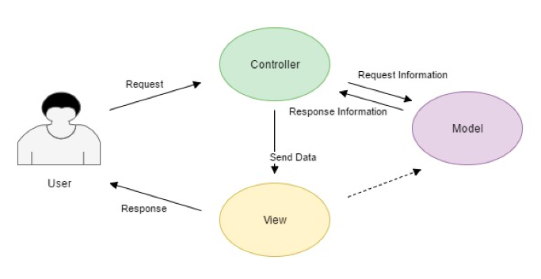

# ⚡ Model View Controller in PHP

A demo for MVC in php.

# What is MVC?

For better readability, rather than mixing our php and html, we can have our project organized in a new software design pattern called MVC( Model View Controller )
MVC divides the related program logic into three interconnected elements: 

1. **Model**: interacts with the database. It receives, stores and retrieves data for the user.
2. **View**: displays information to the user and integrates data from the controller.
3. **Controller**: *sends and receives data from the model and passes to the view.

